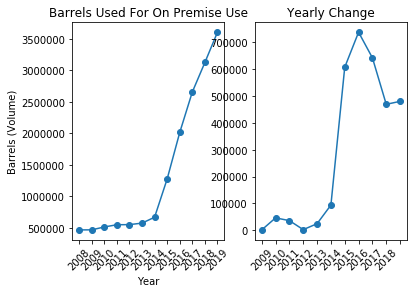
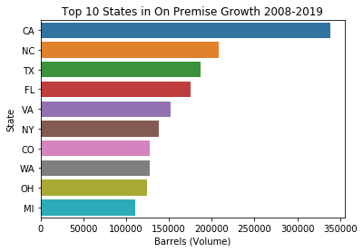
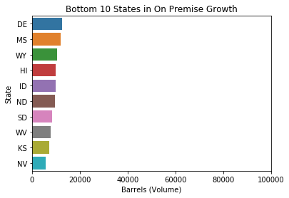
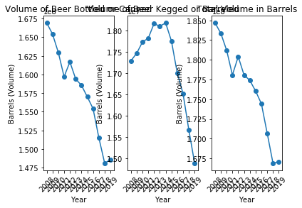
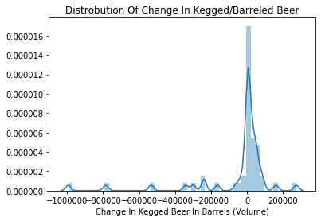
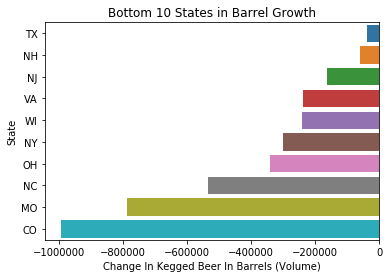

Title: Beer Production Analysis
Date: 2020-07-28
Category: Beer
Author: Scott Hohenwater

I found this data set from the US Department of the Treasury Alcohol and Tobacco Tax and Trade Bureau that shows the volume of beer produced in each state per year (2008-2019)


```python
import requests
import numpy as np
import matplotlib.pyplot as plt
import pandas as pd
import seaborn as sns
bottles = pd.read_excel('https://www.ttb.gov/images/pdfs/statistics/aggregated/aggr-data-beer_2008-2019.xlsx',skiprows=7, sheet_name=1, index_col=0)
barrels = pd.read_excel('https://www.ttb.gov/images/pdfs/statistics/aggregated/aggr-data-beer_2008-2019.xlsx',skiprows=7, sheet_name=2, index_col=0)
on_premise = pd.read_excel('https://www.ttb.gov/images/pdfs/statistics/aggregated/aggr-data-beer_2008-2019.xlsx',skiprows=7, sheet_name=0, index_col=0)
data_group = [bottles, barrels, on_premise]
for x in data_group:
    x.columns= x.columns.astype('str')
    x.columns = x.columns.str.strip('**')
```

I wanted to see the growth of craft breweries most of which (barring any state and local regulations) offer on premise drinking. Depending on the size of the brewery most of their beer produced may be consumed on premise.


```python
temp= on_premise.transpose()
fig, ax = plt.subplots(1,2)
ax[0].plot(temp['total'], marker='o')
ax[0].set_xticklabels(on_premise.columns,rotation=45)
ax[0].set_xlabel('Year')
ax[0].set_ylabel('Barrels (Volume)')
ax[0].set_title('Barrels Used For On Premise Use')
delta=[]
for num in range(11):
    delta.append( temp['total'][num+1]-temp['total'][num])
delta=pd.DataFrame(delta)
delta=delta.set_index(temp.index[0:11])
ax[1].plot(delta, marker='o')
ax[1].set_title('Yearly Change')
ax[1].set_xticks(ticks=delta.index[0:12])
ax[1].set_xticklabels(delta.index[1:13], rotation=45)
plt.show()
```





In 2008 the number of barrels for on premise use around 500,000 barrels a year. In 2015 the start of the craft beer boom occured with a growth of about 60,000 barrels and growth in on premise drinking has continued to grow. In the yearly growth graph you can see that the growth has started to slow down, showing a possible indication that craft beer may be heading to its maximum in several years.

I was curious to check which states had the largest increases in on premise drinking so I calculated the differences between 2008 and 2019.


```python
on_premise['2008']['MS']=0
diff=[]
for index in on_premise.index[1:52]:
    diff.append(on_premise['2019'][index] - on_premise['2008'][index])
diff= pd.DataFrame(diff)
diff[1]= on_premise.index[1:52]
```

    C:\Users\Scott\Anaconda3\lib\site-packages\ipykernel_launcher.py:1: SettingWithCopyWarning: 
    A value is trying to be set on a copy of a slice from a DataFrame
    
    See the caveats in the documentation: http://pandas.pydata.org/pandas-docs/stable/indexing.html#indexing-view-versus-copy
      """Entry point for launching an IPython kernel.
    


```python
diff.columns=['Barrels (Volume)','State']
diff=diff.sort_values('Barrels (Volume)', ascending=False)
top10=diff.head(10)
sns.barplot(y='State', x='Barrels (Volume)', data=top10).set_title('Top 10 States in On Premise Growth 2008-2019')
plt.show()
```





The top states in population make the list, but so do some interesting states like North Carolina, Virginia, and Colorado showing stronger than their population ranks.

I figured I should also check to see the states with the smallest growth.


```python
bottom10=diff.tail(10)
sns.barplot(y='State', x='Barrels (Volume)', data=bottom10).set_title('Bottom 10 States in On Premise Growth')
plt.xlim(0,100000)
plt.show()
```





Here we can see that states with lower populations are consistent, but some states with higher populations did beat out others like Nevada and Kansas at the top of the list.

The next thing I wanted to look at was at how the beer industry was doing overall. With the data I looked at the total volume of beer being produced over the last decade.


```python
temp1=bottles.transpose()
temp2=barrels.transpose()
fig, ax = plt.subplots(1,3)
ax[0].plot(temp1['total'], marker='o')
ax[0].set_xticklabels(on_premise.columns,rotation=45)
ax[0].set_xlabel('Year')
ax[0].set_ylabel('Barrels (Volume)')
ax[0].set_title('Volume of Beer Bottled or Canned')

ax[1].plot(temp2['total'], marker='o')
ax[1].set_xticklabels(on_premise.columns,rotation=45)
ax[1].set_xlabel('Year')
ax[1].set_ylabel('Barrels (Volume)')
ax[1].set_title('Volume of Beer Kegged or Barreled')

temp_total=(temp['total'])+temp1['total']+temp2['total']
ax[2].plot(temp_total, marker='o')
ax[2].set_xticklabels(on_premise.columns,rotation=45)
ax[2].set_xlabel('Year')
ax[2].set_ylabel('Barrels (Volume)')
ax[2].set_title('Total Volume in Barrels')
plt.show()
```





The amount of beer bottled and canned has had a consistent decline since 2008, but the volume kegged and barreled really started to fall during 2014. This the same time which on premise drinking started heavily rising so I would not be surprised if there was a correlation between the two events. In the third graph I plotted the total volume of beer that is bottled, kegged, and used on premise to see overall how much beer was being made and if the rise in on premise use would limit the drop in volume of kegged and bottled beer, but overall it did not significantly change the pattern. 

This could be explained in a couple of ways. If craft beer is the thing causing this downturn in production then it could be from the fact that it costs significantly more than the past mainstays. People only have so much money and probably do not wish to spend too much on a non-necessity like alcohol, therefore buying more expensive beer but less volume than before. Another way that craft beer would affect this is that it also tends to have a higher amount of alcohol in it. An average Budweiser or Miller Beer will usually have an ABV betweeen 4-5%, and a large amount of craft beer will be around 8% getting to near 20% for some on the extreme. So drinking a smaller volume of craft beer can give you the experience of drinking many more traditionally popular beers. 

There could also be another factor such as wine or cocktails also becoming more popular in this time or a trend to live healthier lifestyles. I believe though that craft beer has atleast played some part in this decline in overall volume produced. One way to check is to compare the growth in on premise sales to the growth or decline in kegged beer.


```python
diff1=[]
for index in barrels.index[1:52]:
    diff1.append(barrels['2019'][index] - barrels['2008'][index])
diff1=pd.DataFrame(diff1)
diff1=diff1.fillna(0)
diff1[1]=barrels.index[1:52]
diff1.columns=['Change In Kegged Beer In Barrels (Volume)', 'State']
sns.distplot(diff1 ['Change In Kegged Beer In Barrels (Volume)']).set_title('Distrobution Of Change In Kegged/Barreled Beer')
```


    Text(0.5, 1.0, 'Distrobution Of Change In Kegged/Barreled Beer')





By far most states had near 0 change in volume of beer for kegged beer.


```python
diff1= diff1.sort_values('Change In Kegged Beer In Barrels (Volume)', ascending=False)
trouble=diff1.tail(10)
sns.barplot(y='State', x='Change In Kegged Beer In Barrels (Volume)', data=trouble).set_title('Bottom 10 States in Barrel Growth')
```


    Text(0.5, 1.0, 'Bottom 10 States in Barrel Growth')





Four out of the five largest changes came from states that were in the top ten states with on premise drinking growth. Missouri is the only one that was not, and it lost a very significant amount so let's check out where it ranked in.


```python
print(diff[diff['State']=='MO'])
```

        Barrels (Volume) State
    24           19263.6    MO
    

Missouri was the 34th ranked state for on premise use, but also had the second largest decline in keg use. Considering it is the home of Budweiser, this could show that they are amoung the hardest hit. Along with this Budweiser idea, Coors out of Colorado may be the reason they are so high on the chart.
